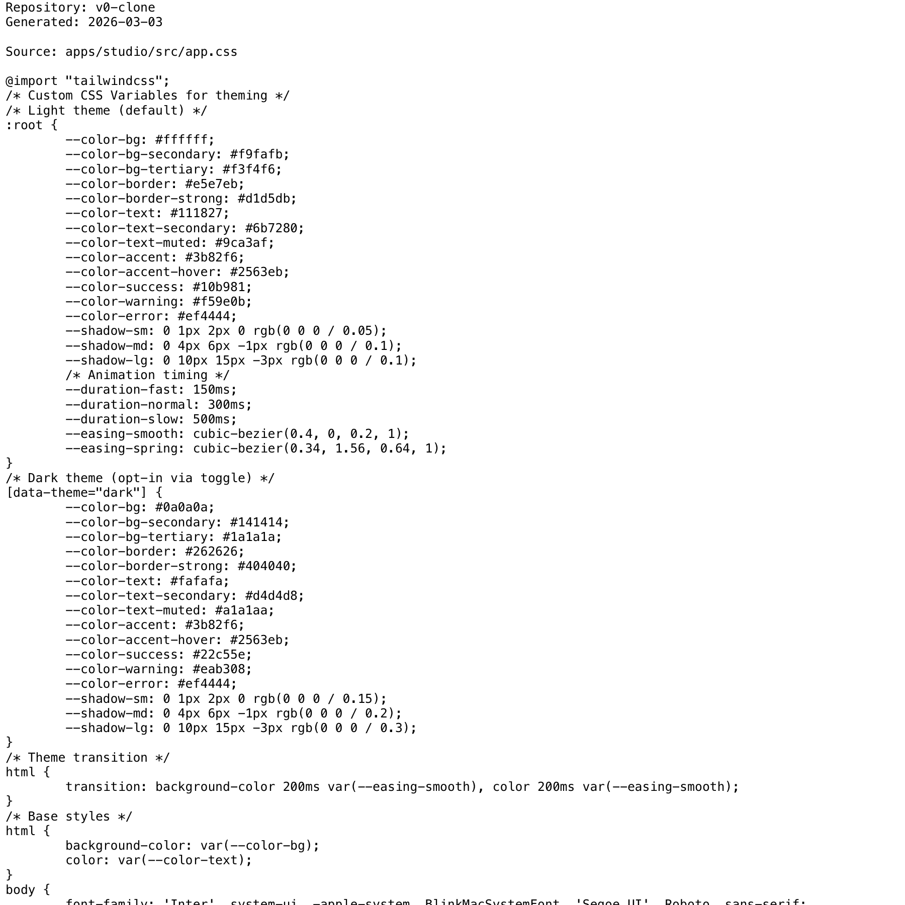

# Project Narrative & Proof

Generated: 2026-03-03

## User Journey
1. Discover the project value in the repository overview and launch instructions.
2. Run or open the build artifact for v0-clone and interact with the primary experience.
3. Observe output/behavior through the documented flow and visual/code evidence below.
4. Reuse or extend the project by following the repository structure and stack notes.

## Design Methodology
- Iterative implementation with working increments preserved in Git history.
- Show-don't-tell documentation style: direct assets and source excerpts instead of abstract claims.
- Traceability from concept to implementation through concrete files and modules.

## Progress
- Latest commit: 91509a3 (2026-03-02) - docs: add badge bar and centered header to README
- Total commits: 12
- Current status: repository has baseline narrative + proof documentation and CI doc validation.

## Tech Stack
- Detected stack: Node.js, TypeScript, GitHub Actions, JavaScript, HTML/CSS

## Main Key Concepts
- Key module area: `apps`
- Key module area: `config`
- Key module area: `examples`
- Key module area: `openspec`
- Key module area: `packages`
- Key module area: `scripts`

## What I'm Bringing to the Table
- End-to-end ownership: from concept framing to implementation and quality gates.
- Engineering rigor: repeatable workflows, versioned progress, and implementation-first evidence.
- Product clarity: user-centered framing with explicit journey and value articulation.

## Show Don't Tell: Screenshots


## Show Don't Tell: Code Excerpt
Source: `apps/studio/src/app.css`

```css
@import "tailwindcss";
/* Custom CSS Variables for theming */
/* Light theme (default) */
:root {
--color-bg: #ffffff;
--color-bg-secondary: #f9fafb;
--color-bg-tertiary: #f3f4f6;
--color-border: #e5e7eb;
--color-border-strong: #d1d5db;
--color-text: #111827;
--color-text-secondary: #6b7280;
--color-text-muted: #9ca3af;
--color-accent: #3b82f6;
--color-accent-hover: #2563eb;
--color-success: #10b981;
--color-warning: #f59e0b;
--color-error: #ef4444;
--shadow-sm: 0 1px 2px 0 rgb(0 0 0 / 0.05);
--shadow-md: 0 4px 6px -1px rgb(0 0 0 / 0.1);
--shadow-lg: 0 10px 15px -3px rgb(0 0 0 / 0.1);
/* Animation timing */
--duration-fast: 150ms;
--duration-normal: 300ms;
--duration-slow: 500ms;
--easing-smooth: cubic-bezier(0.4, 0, 0.2, 1);
--easing-spring: cubic-bezier(0.34, 1.56, 0.64, 1);
}
/* Dark theme (opt-in via toggle) */
[data-theme="dark"] {
--color-bg: #0a0a0a;
--color-bg-secondary: #141414;
--color-bg-tertiary: #1a1a1a;
--color-border: #262626;
--color-border-strong: #404040;
--color-text: #fafafa;
```
